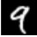
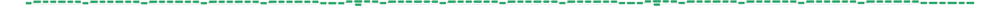
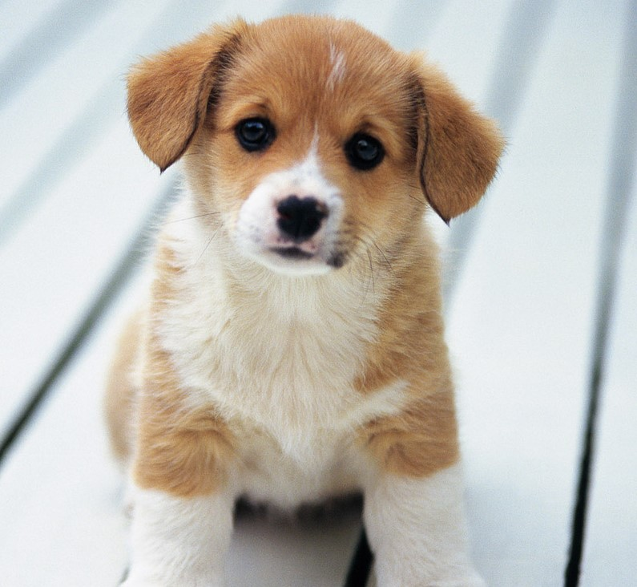
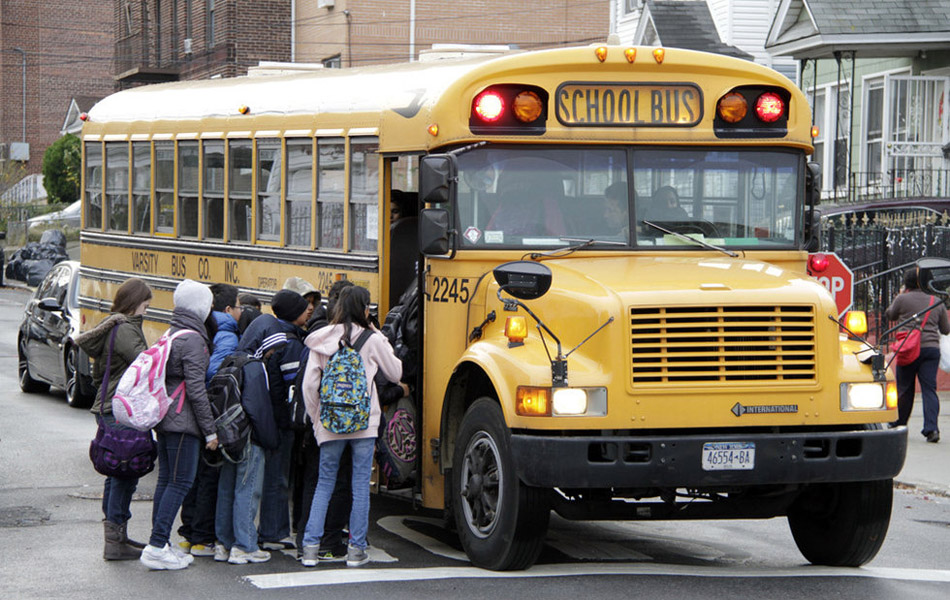
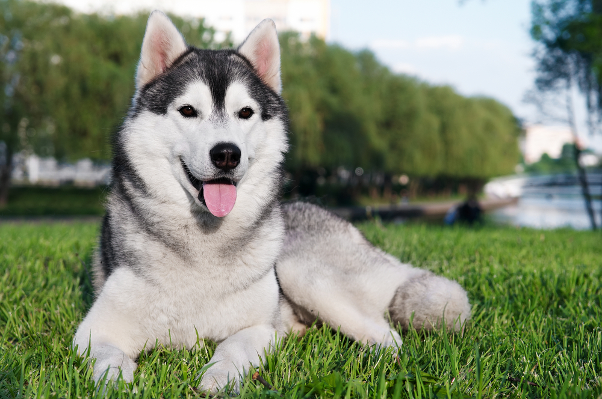
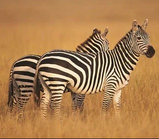
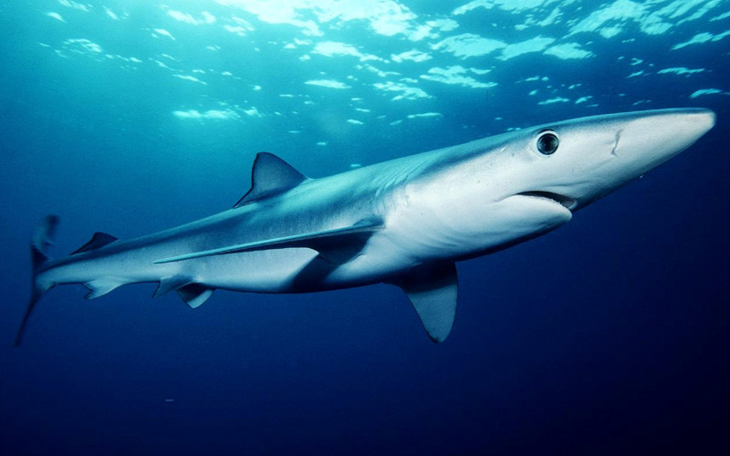

Status: Archive (caffe2 is no longer maintained independently and the [official website](https://caffe2.ai/) is closed, so this project is provided as-is)

# Caffe2 Tutorial

This repository is a simple tutorial about how to use caffe2 with both C++ and python. 

## Contents

1. [Requirements](#requirements)
2. [Introduction](#introduction)
3. [Build](#build)
4. [Usage](#usage)
5. [Contact](#contact)


## Requirements

- caffe2 (tag: pytorch v0.4.0)
- opencv-python
- tabulate

If you want to save the graph, try to install the following packages if you need

```
sudo apt install python-pydot python-pydot-ng graphviz -y
sudo pip3 install pydot
```

###  Attention

**All of the codes have been tested in version ``tag: pytorch v0.4.0``.**  
**tag 0.4.1 or 1.0 can not build the code correclty,**  
**you need to modify them if you must use the latest version.**  

## Introduction

This tutorial contains 6 parts:

```
├─ 01_mnist  
├─ 02_cifar10  
├─ 03_cpp_forward  
├─ 04_caffe_to_caffe2
├─ 05_cifar10_multi_gpu
└─ 06_pytorch_to_caffe2
```

- ``01_mnist`` will show you 
    - how to use caffe2 to build a simple networks by using lmdb data
    - how to save/load models correctly
    - how to use pre-trained model to forward
- ``02_cifar10`` will show you 
    - how to build a residual network **without lmdb data**
        - just use the memory data sampled from generator 
    - how to save/load the networks with **BN layers**
- ``03_cpp_forward`` will show you 
    - how to write a C++ program to load pre-trained model
    - how to write ``CMakeLists.txt`` and use it to compile the C++ program
    - then we will use the C++ program to predict real images
- ``04_caffe_to_caffe2`` will show you 
    -  how to convert caffe model to caffe2 model 
    -  then load it by C++ to predict real images
- ``05_cifar10_multi_gpu`` will show you
    -  how to train model with multiple gpus 
- ``06_pytorch_to_caffe2`` will show you 
    -  how to convert pytorch model to onnx model, and convert onnx model to caffe2
    -  then load it by C++ to predict real images

## Build 

- Make sure you build **caffe2** (and **protobuf**) correctly.
- Make sure you have installed **OpenCV** if you want compile the C++ programs.
- Install required packages if you get a **ImportError** e.g.``No module named tabulate``

**Skip this part if you have successfully installed caffe2**, otherwise you can refer to my [installation steps](https://gist.github.com/BIGBALLON/c428cb75767d40e92be667ee20c4f0c1):


```
# Clone Caffe2's source code from Github repository
git clone https://github.com/pytorch/pytorch.git && cd pytorch
# Checkout the tag v0.4.0
git checkout v0.4.0
# Clone third party dependencies
git submodule update --init

# Create a directory to put Caffe2's build files in
mkdir build && cd build

# Configure Caffe2's build
# This looks for packages on your machine and figures out which functionality
# to include in the Caffe2 installation. The output of this command is very
# useful in debugging.
cmake ..

# Compile, link, and install Caffe2 (-j8 is optional)
sudo make install -j8
```

I just build caffe2 with ``python3.5``, use cmake with  
``-DPYTHON_EXECUTABLE``  
``-DPYTHON_LIBRARY``  
``-DPYTHON_INCLUDE_DIR``    
the cmd looks like:

```
cmake .. -DPYTHON_EXECUTABLE=/usr/bin/python3.5m \
-DPYTHON_LIBRARY=/usr/lib/python3.5/config-3.5m-x86_64-linux-gnu/libpython3.5m.so \
-DPYTHON_INCLUDE_DIR=/usr/include/python3.5m
```

You may modify the code somewhere to make it work if you build caffe2 with ``python2.x``.

For example:

```python
# python2 version
import cPickle
with open(file, 'rb') as fo:
    dict = cPickle.load(fo)

# python3 version:
import pickle
with open(file, 'rb') as fo:
    dict = pickle.load(fo, encoding='bytes')

z = zipfile.ZipFile(BytesIO(r.content)) # python2 version
z = zipfile.ZipFile(StringIO.StringIO(r.content)) # python3 version
```

## Usage


###  01_mnist

Simply run ``python3 caffe2_mnist.py``, the program will download training data automatically.  
Then start training, you will get the final accuracy about ``98.90``%.  

We will also do an predication by using the real images, try to change another one!



```shell
Your data folder was not found!! This was generated: ./data
one or both of the MNIST lmbd dbs not found!!
Downloading... http://download.caffe2.ai/databases/mnist-lmdb.zip to ./data
Completed download and extraction.
training data folder:./data
workspace root folder:./model
== Start training... ==
Iter:     0, Loss: 2.3189, Accuracy: 0.1016
Iter:    50, Loss: 1.8367, Accuracy: 0.3984
Iter:   100, Loss: 0.8075, Accuracy: 0.7031
Iter:   150, Loss: 0.7748, Accuracy: 0.7578
Iter:   200, Loss: 0.5473, Accuracy: 0.8281
...
...
Iter:  9800, Loss: 0.1033, Accuracy: 0.9766
Iter:  9850, Loss: 0.1506, Accuracy: 0.9844
Iter:  9900, Loss: 0.1580, Accuracy: 0.9609
Iter:  9950, Loss: 0.0286, Accuracy: 1.0000
== Done. ==
test_accuracy: 0.9890
== saved init_net and predict_net. ==
== loaded init_net and predict_net. ==

Input: (1, 1, 28, 28)
Output: [[0. 0. 0. 0. 0. 0. 0. 0. 0. 1.]]
Output class: 9


```

###  02_cifar10

Simply run ``python3 caffe2_cifar10.py`` default setting.  
Feel free to change the parameters：
(``python3 caffe2_cifar10.py --help`` to see more details)  

```shell
python3 caffe2_cifar10.py --depths 8 \
                          --batch_size 64 \
                          --epochs 100 \
                          --eval_freq 3
```
You will get test accuracy about ``91``%

```shell
=============== Argument ===============
Namespace(batch_size=128, depths=5, epochs=200, eval_freq=1, init_net='./init_net.pb',
predict_net='./predict_net.pb', test_images=10000, train_images=50000, 
use_augmentation=True, use_gpu=True)
=============== Argument ===============

== Loading data ==
Downloading data from http://www.cs.toronto.edu/~kriz/cifar-10-python.tar.gz
...100%, 162 MB, 5002 KB/s, 33 seconds passedDownload finished. 
Start extract!
Loading ./cifar-10-batches-py/data_batch_1 : 10000.
Loading ./cifar-10-batches-py/data_batch_2 : 10000.
Loading ./cifar-10-batches-py/data_batch_3 : 10000.
Loading ./cifar-10-batches-py/data_batch_4 : 10000.
Loading ./cifar-10-batches-py/data_batch_5 : 10000.
Loading ./cifar-10-batches-py/test_batch : 10000.
Train data: (50000, 3, 32, 32) (50000,)
Test data : (10000, 3, 32, 32) (10000,)
== Shuffling data ==
== Prepare Finished ==

== Training for 200 epochs ==

----  --------  ---------  --------  ---------  --------  --------
  ep        lr    tr_loss    tr_acc    te_loss    te_acc      time
----  --------  ---------  --------  ---------  --------  --------
   1    0.1000     1.3788   49.1009     1.2785   55.3300   14.0707
   2    0.1000     0.9011   68.2824     0.9446   66.4000   13.5369
   3    0.1000     0.7428   73.9750     1.0327   67.4200   13.5050
   4    0.1000     0.6417   77.8273     0.7475   75.4400   13.5161
   5    0.1000     0.5713   80.0871     0.6454   78.3100   13.5315

```

```
graph = net_drawer.GetPydotGraphMinimal(deploy_model)
graph.write_svg('net.svg')
```
``graph.write_svg`` will save the image of our net's architecture, feel free to check it.



###  03_cpp_forward

In this part, we just use the pre-trained model(trained by part02) to predict real images.

Change directory to  ``03_cpp_forward``

Then do:

```shell
mkdir build && cd build
cmake ../
make 
cd ../
```

```shell
bg@bg-CGI:~/Desktop/Caffe2_Demo/03_cpp_forward$ mkdir build && cd build
bg@bg-CGI:~/Desktop/Caffe2_Demo/03_cpp_forward/build$ cmake ../
-- The C compiler identification is GNU 5.4.0
-- The CXX compiler identification is GNU 5.4.0
...
...
-- Looking for pthread_create in pthread
-- Looking for pthread_create in pthread - found
-- Found Threads: TRUE
-- Found CUDA: /usr/local/cuda-8.0 (found version "8.0")
-- Found OpenCV: /usr/local (found version "3.4.1")
    -- Configuring done
-- Generating done
-- Build files have been written to: /home/bg/Desktop/Caffe2_Demo/03_cpp_forward/build
bg@bg-CGI:~/Desktop/Caffe2_Demo/03_cpp_forward/build$ make
Scanning dependencies of target classifier
[ 50%] Building CXX object CMakeFiles/classifier.dir/main.cpp.o
[100%] Linking CXX executable ../classifier
[100%] Built target classifier
```

Then you can see the executable file ``classifier``  

Run ``./classifier --file ./test_img/dog.jpg``



Then you can see:

```
== image size: [795 x 732] ==
== simply resize: [32 x 32] ==
== predicted label: dog ==
== with probability: 100% ==
```
Run ``./classifier --file ./test_img/frog.jpg``


```
== image size: [184 x 160] ==
== simply resize: [32 x 32] ==
== predicted label: frog ==
== with probability: 99.7764% ==
```


###  04_caffe_to_caffe2

Now, we will try to convert an pre-trained ImageNet caffe model to caffe2 model.  

- Download caffe pre-trained model [url here](https://onedrive.live.com/?authkey=%21AAFW2-FVoxeVRck&id=4006CBB8476FF777%2117887&cid=4006CBB8476FF777) (``ResNet-50-deploy.prototxt`` and ``ResNet-50-model.caffemodel``) firstly


- Then, do ``python3 caffe_translator.py ResNet-50-deploy.prototxt ResNet-50-model.caffemodel``

Now we will see 3 new files

```
init_net.pb             %[converted init weights]
predict_net.pb          %[converted net]
predict_net.pbtxt       %[converted pb txt]
```

- Build C++ program

```shell
mkdir build && cd build
cmake ../
make 
cd ../
```

- Run C++ program with converted caffe2 weights

``./classifier --file ./test_img/school_bus.jpg``



```
== image size: [950 x 600] ==
== simply resize: [224 x 224] ==
== predicted label: 779 ==
== label name: school bus ==
== with probability: 99.9992% ==
```

``./classifier --file ./test_img/husky.jpg``



```
== image size: [1000 x 664] ==
== simply resize: [224 x 224] ==
== predicted label: 248 ==
== label name: Eskimo dog, husky ==
== with probability: 72.7978% ==
```

``./classifier --file test_img/zebra.jpg``



```
== image size: [319 x 279] ==
== simply resize: [224 x 224] ==
== predicted label: 340 ==
== label name: zebra ==
== with probability: 99.8892% ==
```

``./classifier --file test_img/shark.jpg``



```
== image size: [800 x 500] ==
== simply resize: [224 x 224] ==
== predicted label: 3 ==
== label name: tiger shark, Galeocerdo cuvieri ==
== with probability: 76.2018% ==
```

Feel free to change the test images, it's fun. :smile:


###  05_cifar10_multi_gpu

The most important point in multi-gpu training is ``data_parallel_model.Parallelize_GPU``,  
The key is to split your model creation code to three functions. 
check [SynchronousSGD](https://caffe2.ai/docs/SynchronousSGD.html) for more details.

### 06_pytorch_to_caffe2

Now, let us try to convert pytorch model to caffe2 model.  
We will use the tool [ONNX(Open Neural Network Exchange)](https://github.com/onnx).

First, run ``pytorch2onnx.py``, donwload a pytorch model resnet50, convert it to onnx model.  
Then, run ``onnx2caffe2.py`` convert the onnx model to caffe2 model.

```
python3 onnx2caffe2.py --onnx-model ONNX_MODEL \
--caffe2-init CAFFE2_INIT \
--caffe2-predict CAFFE2_PREDICT

```
We will get three files: ``onnx-predict.pbtxt``, 

```
init_net.pb             %[converted init weights]
predict_net.pb          %[converted net]
onnx-predict.pbtxt      %[converted pb txt]
```

Modify the ``main.cpp``, then compile it by cmake.

```
./classifier --file ./test_img/school_bus.jpg

== image size: [950 x 600] ==
== simply resize: [224 x 224] ==
== predicted label: 779 == 
== label name: school bus ==
== with acc: 70.0677% ==

```


## Contact

fm.bigballon at gmail.com  

Please feel free to contact me if you have any questions! :smile_cat: 

Have a good day!! :smile:
